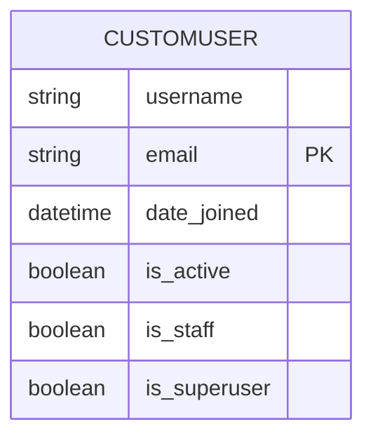
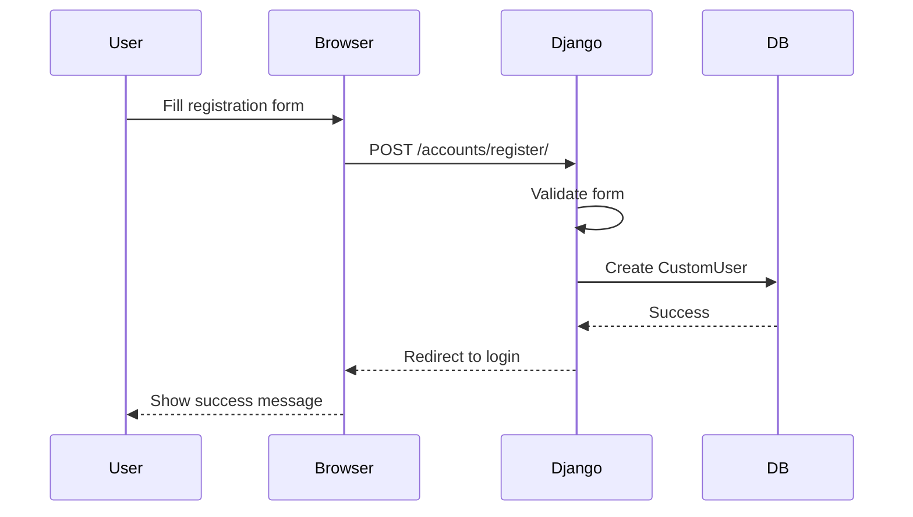
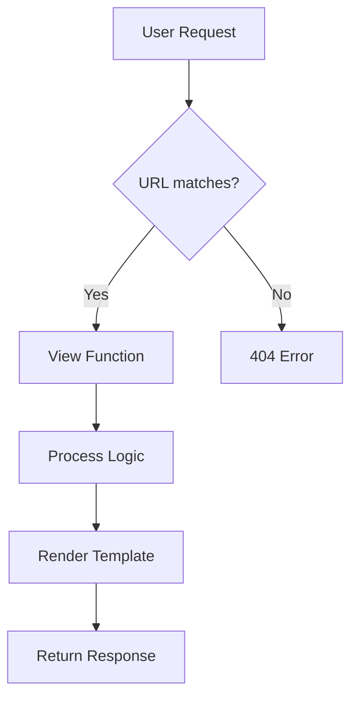

# Building a Django SaaS App Template: From Scratch to Subscription-Ready

**Published on December 30, 2025**  
*By Cliff*  

## TL;DR

A short, practical guide to scaffolding a Django-based SaaS starter app with email-based authentication, Bootstrap UI, and environment-based settings. Follow the steps to create the project, add a custom user model, wire up authentication views and templates, and prepare for local testing. Production deployment and hardening will be covered in Tutorial 3.

## Prerequisites

- Python 3.10 or newer
- Basic familiarity with the command line and Git
- Estimated time: 30–90 minutes (depending on familiarity)

## Table of Contents

- [Step 1: Environment Setup and Project Initialization](#step-1-environment-setup-and-project-initialization)
- [Step 2: Custom User Model for Email-Based Authentication](#step-2-custom-user-model-for-email-based-authentication)
- [Step 3: Authentication Views, Forms, and Templates](#step-3-authentication-views-forms-and-templates)
- [Step 4: Core App and Responsive UI](#step-4-core-app-and-responsive-ui)
- [Navbar & Navigation](#navbar--navigation)
- [Step 5: Testing, Running, and Deployment Prep](#step-5-testing-running-and-deployment-prep)
- [Visual Overview: Project Structure and Flows](#visual-overview-project-structure-and-flows)
- [Quick Commands Cheat Sheet](#quick-commands-cheat-sheet)
- [Frontend details: forms, theme toggle, and color fixes](#frontend-details-forms-theme-toggle-and-color-fixes)
- [Technical accuracy & production notes](#technical-accuracy--production-notes)

## One-page Quick Reference

Use this page as a compact cheat-sheet for the most common tasks and file locations.

- Key commands

```bash
# Create & activate venv (Windows)
python -m venv .venv
.venv\Scripts\activate

# Install deps
python -m pip install --upgrade pip
python -m pip install -r requirements.txt

# Create project and app
django-admin startproject config .
python manage.py startapp accounts

# Migrations, superuser, run
python manage.py makemigrations
python manage.py migrate
python manage.py createsuperuser
python manage.py runserver
```

- Key files and where to edit them

- `config/settings.py`: environment loading, `AUTH_USER_MODEL`, security settings
- `accounts/models.py`: custom user model
- `accounts/forms.py`: form widgets and Bootstrap classes
- `accounts/urls.py` and `accounts/views.py`: authentication flows
- `core/templates/core/base.html`: shared layout, navbar, theme toggle

- Quick troubleshooting

- Missing SECRET_KEY or env values: ensure `.env` exists and `env.read_env()` points to it.
- Migrations fail after changing `AUTH_USER_MODEL`: revert changes or recreate migrations carefully; prefer setting `AUTH_USER_MODEL` before the first migrations.
- Templates not found: verify `TEMPLATES['DIRS']` and that your templates are in `templates/<app>/` or app-level `templates/` folders and that `APP_DIRS` is True.
- Static files look wrong in production: run `python manage.py collectstatic` and confirm `STATIC_ROOT` + whitenoise/Nginx config (deployment details covered in Tutorial 3).


## Introduction: Why Django for SaaS Apps?

In the world of web development, building a Software as a Service (SaaS) application requires a framework that handles user authentication, scalability, and rapid prototyping. Django, a high-level Python web framework, excels here due to its "batteries included" philosophy—meaning it comes with built-in tools for databases, admin interfaces, authentication, and more. This reduces boilerplate code and lets you focus on your app's unique features.

This tutorial guides you through creating a "Django Mega Tutorial" app template. It's designed for modern SaaS platforms, like social media sites where users sign up for free initially. We'll emphasize best practices: security, modularity, and extensibility. By the end, you'll have a deployable app ready for free-tier users. And yes, we'll touch on future enhancements like integrating with Stripe for paid subscriptions to show how this scales into a monetized product.

**Why this approach?** Many tutorials start simple but leave out production concerns. Here, we prioritize security (environment variables), user experience (responsive UI), and growth (custom models). This isn't a toy example but a foundation for real apps.

## Step 1: Environment Setup and Project Initialization

What you'll do in this step:

- Create and activate a virtual environment
- Install core dependencies
- Create the Django project scaffold and basic settings


### Installing Python and Virtual Environments

First, ensure you have Python installed. Download the latest version from [python.org](https://www.python.org/downloads/). We recommend Python 3.10+ for its stability and Django compatibility.

**Reasoning:** Using a virtual environment isolates dependencies, preventing conflicts with system Python. This is a Django best practice to avoid "works on my machine" issues.

Create and activate a virtual environment:

```bash
python -m venv .venv
# On Windows:
.venv\Scripts\activate
# On macOS/Linux:
source .venv/bin/activate
```

### Dependencies and Requirements

Create `requirements.txt` in the project root:

```
django
django-environ
```

Install them:

```bash
python -m pip install -r requirements.txt
```

**Reasoning:** `django-environ` manages sensitive settings via environment variables, avoiding hardcoding secrets. We start minimal—add more libraries (e.g., Stripe) as needed to keep the tutorial focused.

### Creating the Django Project

Run:

```bash
django-admin startproject config .
```

This creates `manage.py` and the `config/` directory with core files such as `settings.py` and `urls.py`.

**Reasoning:** Naming the project `config` (instead of the default app name) creates a cleaner structure. The `.` places files in the root, making it easier to manage with tools like Docker or deployment scripts.

### Environment-Based Settings

Edit `config/settings.py`. Add at the top:

```python
from pathlib import Path
import environ

# Build paths inside the project like this: BASE_DIR / 'subdir'.
BASE_DIR = Path(__file__).resolve().parent.parent

# Initialize environment variables
env = environ.Env()
env.read_env(BASE_DIR / '.env')
```

Update settings to use env vars:

```python
SECRET_KEY = env('DJANGO_SECRET_KEY')
DEBUG = env.bool('DJANGO_DEBUG', default=False)
ALLOWED_HOSTS = env.list('DJANGO_ALLOWED_HOSTS', default=[])
```

Create `.env` (and `.env.example` for sharing):

```dotenv
DJANGO_SECRET_KEY=your-super-secret-key-here-generate-a-new-one
DJANGO_DEBUG=True
DJANGO_ALLOWED_HOSTS=localhost,127.0.0.1
```

**Reasoning:** Hardcoding secrets is a security risk. Environment variables keep them out of version control. `django-environ` simplifies this. The `.env.example` acts as documentation for collaborators.

Set `DJANGO_SETTINGS_MODULE` and check (on Windows use `set` or PowerShell `setx` as appropriate):

```bash
# Unix / macOS (example)
export DJANGO_SETTINGS_MODULE=config.settings
python manage.py check

# On Windows (cmd.exe)
set DJANGO_SETTINGS_MODULE=config.settings
python manage.py check
```

**Reasoning:** This validates configuration early, catching issues before adding complexity.

## Step 2: Custom User Model for Email-Based Authentication

Django's default user model uses username, but email is more user-friendly for SaaS apps.

What you'll do in this step:

- Create the `accounts` app
- Define a custom user model using email as the `USERNAME_FIELD`
- Wire the custom user model into `AUTH_USER_MODEL` in settings


Create the `accounts` app:

```bash
python manage.py startapp accounts
```

In `accounts/models.py`, define the custom model:

```python
from django.db import models
from django.contrib.auth.models import AbstractBaseUser, BaseUserManager

class CustomUserManager(BaseUserManager):
    def create_user(self, username, email, password=None):
        if not email:
            raise ValueError("Users must have an email address")
        email = self.normalize_email(email)
        user = self.model(username=username, email=email)
        user.set_password(password)
        user.save(using=self._db)
        return user

    def create_superuser(self, username, email, password):
        user = self.create_user(username, email, password)
        user.is_staff = True
        user.is_superuser = True
        user.save(using=self._db)
        return user

class CustomUser(AbstractBaseUser):
    username = models.CharField(max_length=150, unique=True)
    email = models.EmailField(unique=True)
    date_joined = models.DateTimeField(auto_now_add=True)
    is_active = models.BooleanField(default=True)
    is_staff = models.BooleanField(default=False)
    is_superuser = models.BooleanField(default=False)

    objects = CustomUserManager()

    USERNAME_FIELD = 'email'
    REQUIRED_FIELDS = ['username']

    def __str__(self):
        return self.email
```

Update `config/settings.py`:

```python
INSTALLED_APPS = [
    'django.contrib.admin',
    'django.contrib.auth',
    'django.contrib.contenttypes',
    'django.contrib.sessions',
    'django.contrib.messages',
    'django.contrib.staticfiles',
    'accounts',
]
AUTH_USER_MODEL = 'accounts.CustomUser'
```

Important: set `AUTH_USER_MODEL` in `config/settings.py` before creating your project's initial migrations. Changing the `AUTH_USER_MODEL` later is possible but requires careful manual migration work and can be error-prone.

Run migrations:

```bash
python manage.py makemigrations accounts
python manage.py migrate
```

**Reasoning:** Custom user models allow flexibility (e.g., email login). We extend `AbstractBaseUser` for control. Migrations ensure the database schema matches. This is crucial for SaaS, where user data is central.

## Step 3: Authentication Views, Forms, and Templates

### Forms with Bootstrap Styling

In `accounts/forms.py`, create forms for registration, login, and password reset. Use Bootstrap classes for responsive design.

What you'll do in this step:

- Create form classes and widget attributes for Bootstrap styling
- Add views for registration, login, logout, and profile
- Add templates that extend the shared `base.html`


**Reasoning:** Bootstrap ensures mobile-friendly UI without custom CSS. Custom forms integrate with our user model.

### Views for User Flows

In `accounts/views.py`, implement class-based views for registration and function-based for login/logout/profile. Use Django's built-in password reset views.

**Reasoning:** Class-based views reduce code duplication. Function views for simplicity where needed. Messages provide user feedback.

### URLs and Templates

In `accounts/urls.py`, map URLs to views. Create templates in `accounts/templates/accounts/` for each page, extending a base template.

**Reasoning:** Organized URLs prevent conflicts. Templates separate logic from presentation, following Django's MTV pattern.

### Frontend details: forms, theme toggle, and color fixes

Short frontend guidance so readers won't be surprised by Bootstrap + dark/light theme issues.

- Forms: in `accounts/forms.py` prefer adding only layout classes (e.g., `form-control`) to widgets rather than background color utilities. Example:

```python
from django import forms

class RegisterForm(forms.ModelForm):
    class Meta:
        model = CustomUser
        fields = ['username', 'email', 'password']
        widgets = {
                'username': forms.TextInput(attrs={'class': 'form-control', 'placeholder': 'Username'}),
                'email': forms.EmailInput(attrs={'class': 'form-control', 'placeholder': 'Email'}),
        }
```

- Theme toggle: store the choice in `localStorage` and toggle a `dark` class on the document element. Keep the JS minimal and place it near the end of `base.html`:

```html
<script>
    const toggle = document.getElementById('theme-toggle');
    toggle && toggle.addEventListener('click', () => {
        document.documentElement.classList.toggle('dark');
        localStorage.theme = document.documentElement.classList.contains('dark') ? 'dark' : 'light';
    });
</script>
```

- Color fixes: if some colors look off in dark or light mode, the usual fix is to remove utility classes like `bg-primary` or `bg-secondary` from components — those color utilities can clash with either or both themes. Prefer neutral utilities (`bg-light` / `bg-dark`) or, better, use CSS variables for colors and override Bootstrap variables so your theme switches cleanly.

- Testing: test key pages (login, register, profile) in both themes and on mobile widths to ensure spacing and contrast remain good.

## Step 4: Core App and Responsive UI

Create the `core` app for the homepage:

What you'll do in this step:

- Create the `core` app and index view
- Create a shared `base.html` with navigation and theme toggle
- Add simple pages that extend `base.html`


```bash
python manage.py startapp core
```

Add it to `INSTALLED_APPS`. Create a simple index view and template.

For the base template (`core/templates/core/base.html`), use Bootstrap 5 with a navbar, theme toggle, and content blocks. Include JavaScript for dark/light mode.

**Reasoning:** A shared base reduces duplication. Bootstrap + theme toggle improves UX. JavaScript is minimal and client-side for performance.

Update `config/urls.py` to include app URLs.

### Navbar & Navigation

A shared navbar in `core/templates/core/base.html` improves site navigation and UX. Use Bootstrap 5's responsive navbar and Django template conditionals to show links based on authentication state.

Key points:
- Use `` and include Bootstrap (CDN or local) in the head.
- Ensure the auth context processor is enabled (it's included by default in Django's `TEMPLATES` setting) so `user` is available in templates.
- Use a POST form for logout to avoid side effects from a GET request.

Example `base.html` navbar (Bootstrap 5):

```html

<!doctype html>
<html lang="en">
    <head>
        <!-- Bootstrap CSS via CDN (or use static files) -->
        <link href="https://cdn.jsdelivr.net/npm/bootstrap@5.3.0/dist/css/bootstrap.min.css" rel="stylesheet">
    </head>
    <body>
        <nav class="navbar navbar-expand-lg navbar-light bg-light">
            <div class="container-fluid">
                <a class="navbar-brand" href="">MyApp</a>
                <button class="navbar-toggler" type="button" data-bs-toggle="collapse" data-bs-target="#navbarNav" aria-controls="navbarNav" aria-expanded="false" aria-label="Toggle navigation">
                    <span class="navbar-toggler-icon"></span>
                </button>
                <div class="collapse navbar-collapse" id="navbarNav">
                    <ul class="navbar-nav me-auto mb-2 mb-lg-0">
                        <li class="nav-item"><a class="nav-link" href="">Home</a></li>
                        <li class="nav-item"><a class="nav-link" href="">About</a></li>
                    </ul>

                    <ul class="navbar-nav">
                        
                            <li class="nav-item"><a class="nav-link" href="">Profile</a></li>
                            <li class="nav-item">
                                <form method="post" action="" class="d-inline">
                                    
                                    <button type="submit" class="btn btn-link nav-link" style="display:inline;">Logout</button>
                                </form>
                            </li>
                        
                            <li class="nav-item"><a class="nav-link" href="">Login</a></li>
                            <li class="nav-item"><a class="nav-link" href="">Register</a></li>
                        
                    </ul>
                </div>
            </div>
        </nav>

        

        <script src="https://cdn.jsdelivr.net/npm/bootstrap@5.3.0/dist/js/bootstrap.bundle.min.js"></script>
    </body>
</html>
```

Notes:
- Adjust link names to match your URL names (e.g., `'index'`, `'profile'`, `'register'`).
- Styling: prefer neutral background utilities or CSS variables; avoid `bg-primary`/`bg-secondary` for large surfaces since they often don't switch well across light/dark themes.

## Step 5: Testing, Running, and Deployment Prep

Create a superuser for admin access:

What you'll do in this step:

- Create a superuser for admin access
- Run the development server and test flows locally
- Prepare basic production notes (logging, static files)
 - Prepare basic production notes (logging, static files) — production hardening is out of scope for this tutorial


```bash
python manage.py createsuperuser
```

Run the server:

```bash
python manage.py runserver
```

Test registration, login, and profile.

**Reasoning:** Superuser allows admin panel access. Local testing ensures functionality before deployment.

For production (out of scope for this tutorial), add logging, static file serving, and consider Heroku/Docker. See the upcoming Tutorial 3 for a full deployment walkthrough.

## Technical accuracy & production notes

Note: the following are general production tips and checklist items. Full, step-by-step production deployment and hardening are out of scope for this first tutorial and will be covered in detail in Tutorial 3. Use these as high-level guidance only.

This section collects important, actionable details to avoid common pitfalls when moving from a local tutorial to a real deployment.

Security & settings
- Keep `.env` out of version control and add it to `.gitignore`.
- Use `django-environ` or similar to load `DATABASE_URL`, `DJANGO_SECRET_KEY`, and other secrets.
- Example security settings to enable in production (`config/settings.py`):

```python
DEBUG = env.bool('DJANGO_DEBUG', default=False)
if not DEBUG:
    SESSION_COOKIE_SECURE = True
    CSRF_COOKIE_SECURE = True
    SECURE_SSL_REDIRECT = True
    SECURE_HSTS_SECONDS = 31536000
    SECURE_HSTS_INCLUDE_SUBDOMAINS = True
    SECURE_HSTS_PRELOAD = True
    X_FRAME_OPTIONS = 'DENY'
```

Databases
- Use SQLite for development, but pick Postgres (recommended) for production.
- Use `DATABASE_URL` and `django-environ` or `dj-database-url` to configure databases from env vars.

Static files & assets
- Set a `STATIC_ROOT` and run `python manage.py collectstatic` during deployment.
- For simple deployments, use `whitenoise` to serve static files from Django. In a more robust setup, serve static assets via a CDN behind Nginx.

Migrations & custom user model
- Always set `AUTH_USER_MODEL` before creating your initial migrations. If you change it later, you will need manual migration fixes.
- Typical workflow after adding models:

```bash
python manage.py makemigrations
python manage.py migrate
```

Email and password reset during development
- Use the console email backend while developing so reset emails print to the terminal:

```python
EMAIL_BACKEND = 'django.core.mail.backends.console.EmailBackend'
```

Running in production
- Common stack: Gunicorn + Nginx (Gunicorn runs the WSGI app; Nginx proxies, serves static files, and handles TLS).
- Example command to start the app with Gunicorn:

```bash
gunicorn config.wsgi:application --bind 0.0.0.0:8000 --workers 3
```

- Use process managers (systemd, supervisord) or container orchestration in production.

Monitoring & logging
- Enable structured logging and error reporting (Sentry, Rollbar) before public launch.

Testing
- Add tests for authentication flows (registration, login, password reset) and run them in CI.
- Test key pages with `DEBUG=False` locally to catch template/static errors you won't see with `DEBUG=True`.

## Visual Overview: Project Structure and Flows

To better understand the project, here are visual representations of the structure and key flows.

### Project Directory Tree

After following the steps, your project structure should look like this (excluding virtual environment and cache files):

```
./
├── .env
├── .env.example
├── .gitignore
├── accounts/
│   ├── __init__.py
│   ├── admin.py
│   ├── apps.py
│   ├── forms.py
│   ├── models.py
│   ├── templates/
│   │   └── accounts/
│   │       ├── logged_out.html
│   │       ├── login.html
│   │       ├── password_reset.html
│   │       ├── password_reset_complete.html
│   │       ├── password_reset_confirm.html
│   │       ├── password_reset_done.html
│   │       ├── password_reset_email.html
│   │       ├── profile.html
│   │       └── register.html
│   ├── tests.py
│   ├── urls.py
│   └── views.py
├── config/
│   ├── __init__.py
│   ├── asgi.py
│   ├── settings.py
│   ├── urls.py
│   └── wsgi.py
├── core/
│   ├── __init__.py
│   ├── admin.py
│   ├── apps.py
│   ├── models.py
│   ├── templates/
│   │   └── core/
│   │       ├── base.html
│   │       └── index.html
│   ├── tests.py
│   ├── urls.py
│   └── views.py
├── db.sqlite3
├── django.log
├── manage.py
├── requirements.txt
├── tree.py
└── tutorial-001.md
```

**Reasoning:** This tree helps you verify your setup and locate files quickly. The modular structure (apps in separate folders) makes it easy to add features like payments without cluttering the codebase.

### Entity Relationship Diagram

The data model is simple but extensible. Here's the ER diagram for the current models:



**Reasoning:** ER diagrams clarify data relationships. Here, `CustomUser` is the core entity with email as the unique identifier. Future additions (e.g., posts, subscriptions) will expand this.

### Sequence Diagram: User Registration Flow

This shows the step-by-step interaction during registration:



**Reasoning:** Sequence diagrams illustrate dynamic behavior. This flow ensures secure user creation with validation and feedback, preventing errors like duplicate emails.

### Flowchart: Django Request-Response Cycle

A high-level view of how Django processes requests:



**Reasoning:** Flowcharts show decision points and logic flow. This diagram helps tune performance—e.g., optimize views or add caching at key steps.

## Quick Commands Cheat Sheet

```bash
# Create and activate venv (Windows)
python -m venv .venv
.venv\Scripts\activate

# macOS/Linux
source .venv/bin/activate

# Upgrade pip and install dependencies
python -m pip install --upgrade pip
python -m pip install -r requirements.txt

# Start project and apps
django-admin startproject config .
python manage.py startapp accounts

# Migrations and run
python manage.py makemigrations
python manage.py migrate
python manage.py createsuperuser
python manage.py runserver
```

## Conclusion: Free Today, Paid Tomorrow

This template is suitable for local and free-tier SaaS apps like a prototype social platform where users can sign up, authenticate, and engage. Full production hardening (TLS, scaling, backups, CDN, etc.) is out of scope for this tutorial and will be covered in Tutorial 3.

But the real power is extensibility. In upcoming tutorials, we'll add Stripe for payments, turning this into a full SaaS with tiers. This foundation will eventually support premium features unlocked via subscriptions.

**Why this matters:** SaaS thrives on user growth first, monetization second. Start free, scale paid.

Full code: [GitHub Repo Link]. Questions? Comment below!